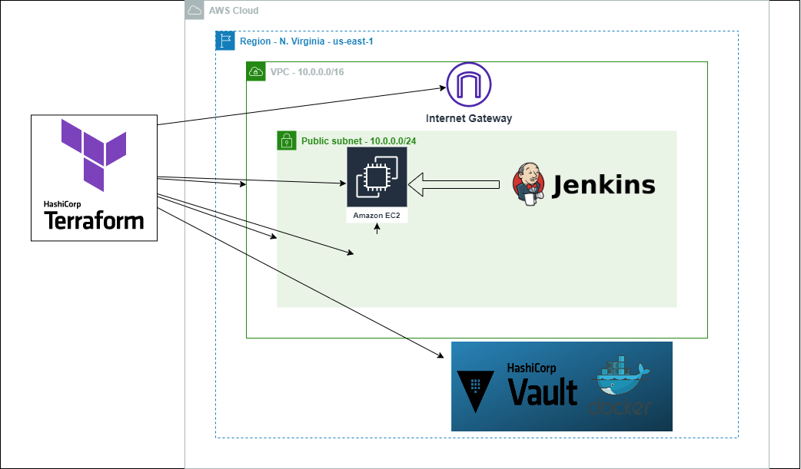
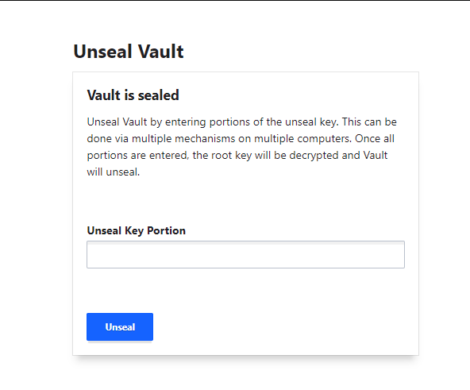
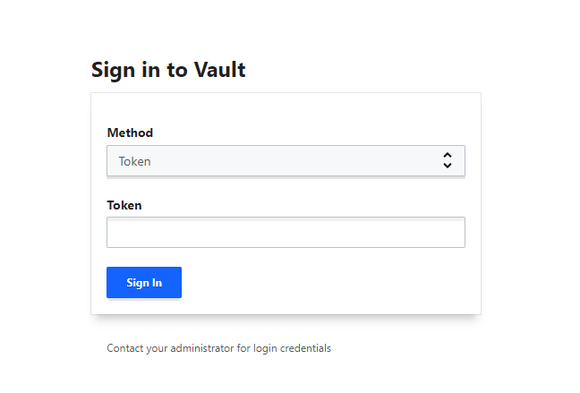
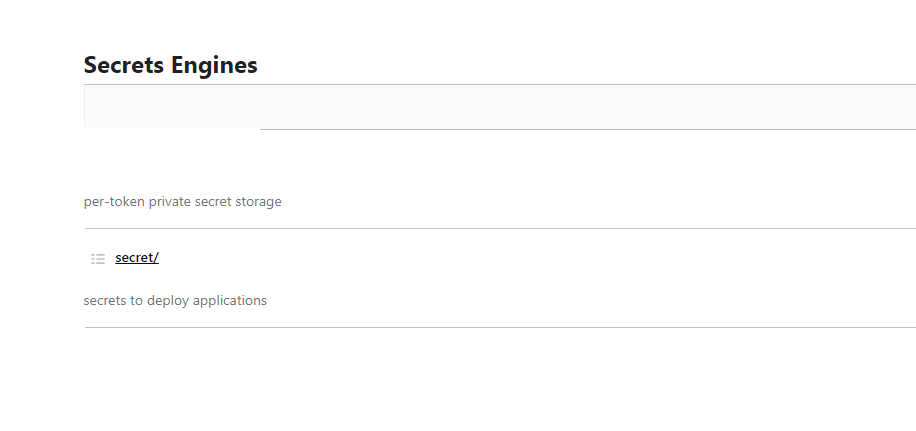
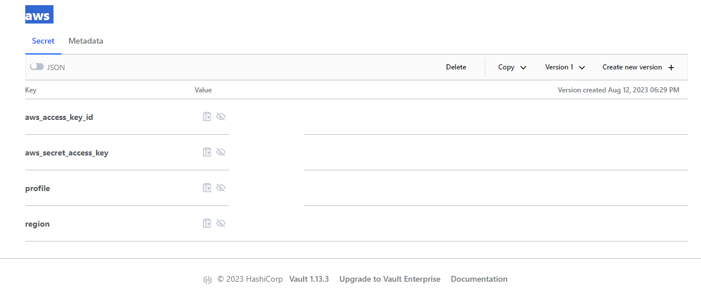

# Instalando o Jenkins em uma EC2

Jenkins é um software focado em entrega contínua para fazer o pipeline de suas aplicações.


## Tecnologias utilizadas

 - [Amazon AWS](https://aws.amazon.com)
 - [Hashicorp Terraform](https://registry.terraform.io/providers/hashicorp/aws/latest/docs)
 - [Hashicorp Vault](https://www.hashicorp.com/products/vault)

 - [Docker](https://www.docker.com/)


## Authors

- [@oguilhermesoares](https://www.github.com/guilhermesgit)


## Criação da aplicação

Antes de utilizar a aplicação é necessário ter os seguintes programas instalados: 

- Docker local
- AWS cli
- docker-compose
- terraform cli
- VSCode
```bash
   Subindo o hashicorp vault localmente utilizando docker-compose
   cd vault ; docker-compose up -d 

```

Para visualizar se o container subiu digite:
docker ps |grep -i vault

Acessando a aplicação:

http://localhost:8200

Dentro do seu terminal, após gerar a key e root token, faça variáveis de ambiente para não export as credenciais no código.

 export VAULT_ADDR=http://127.0.0.1:8200

 Após logar, o sistema irá pedir para vc digitar a quantidade de keys digite: 1 ,1
 Você terá um key e um root token para acessar.

 export VAULT_TOKEN="cole o token aqui"

 Para verificar se deu certo, digite:

 vault status dentro do cli do seu pc.
## Documentação


[AWS](https://aws.amazon.com)
[Docker](https://www.docker.com)
[Terraform](https://registry.terraform.io/providers/hashicorp/vault/latest/docs)
[Vault](https://www.vaultproject.io/)


## Cenário 
A ideia é utilizar o Hashicorp vault para armazenas a secret do provider da aws onde ele pode ser utilizado via profile, variáveis de ambiente.
Utilizando o vault, podemos criar as credenciais genéricas e criar os ambientes de desenvolimento

[dev]secret/aws-dev

[homol]secret/aws-homol

[prod]secret/aws-prod

Cada secret representaria um profile do aws config.


## Cenário









